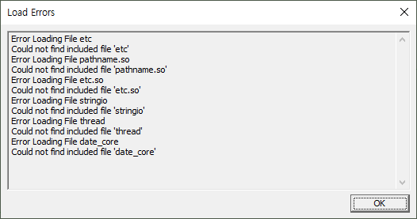
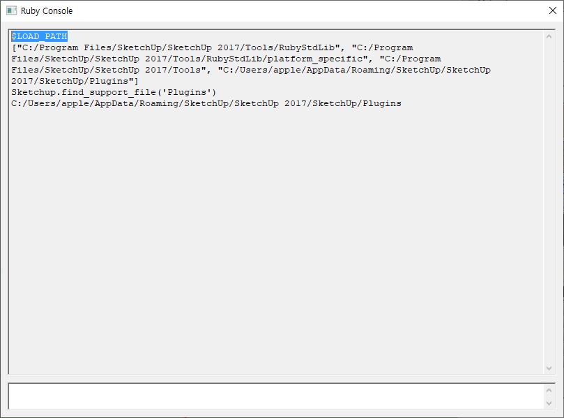

# indoorgml-modeler

download installer here 

https://drive.google.com/file/d/1Np-zGIGPJmIlSmqNGluXXncjc92To2nq/view?usp=sharing

If you meet error like this.

Check if the installation was successful. 

"C:/Program Files/SketchUp/SketchUp 2017/Tools/RubyStdLib/platform_specific" should exist.